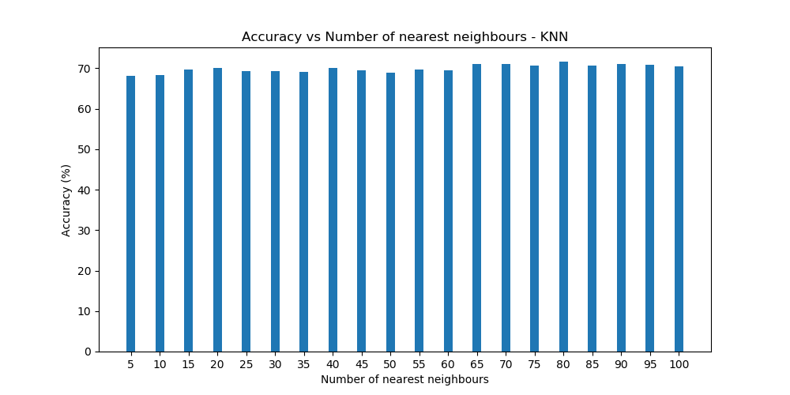
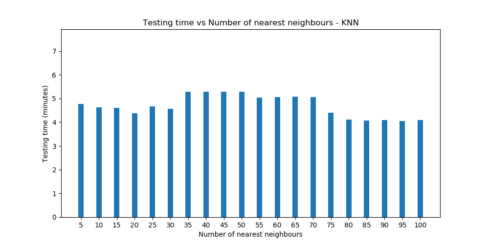
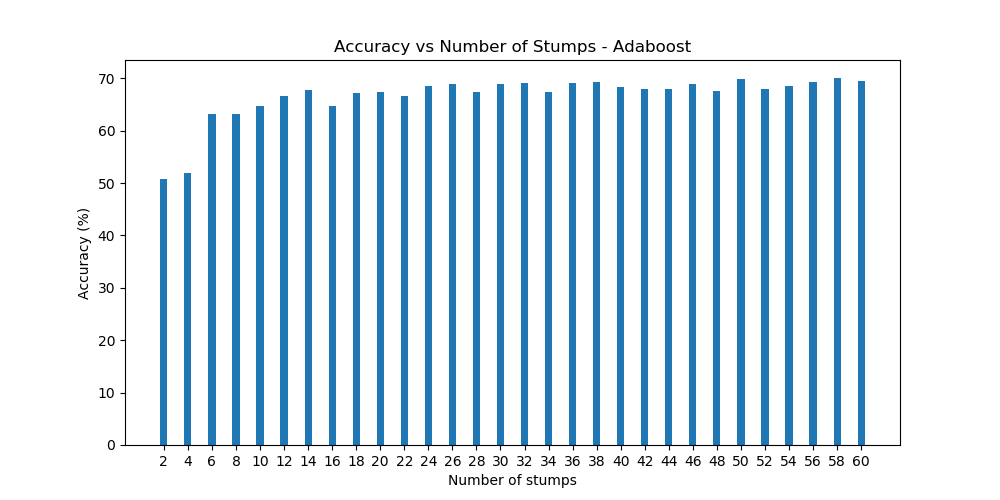
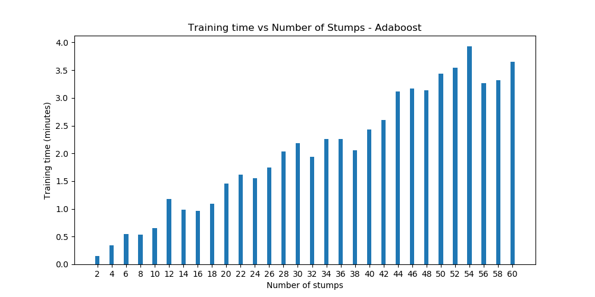
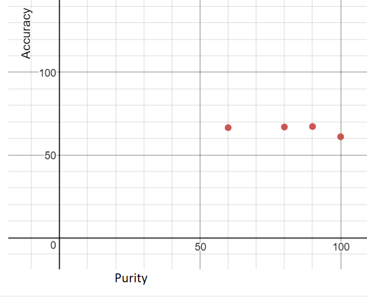
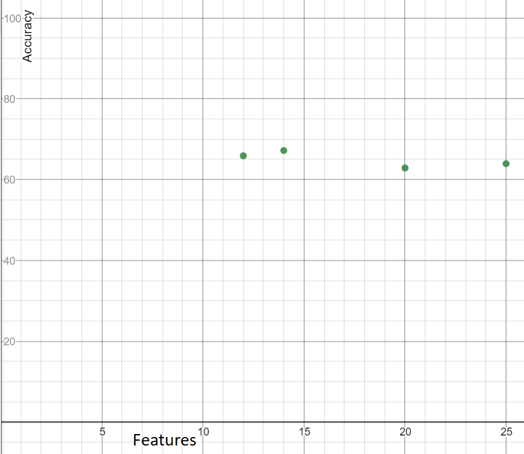
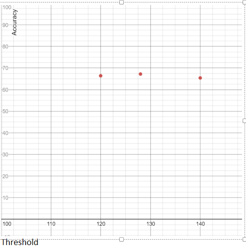
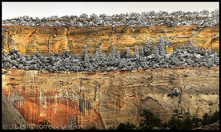
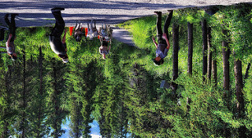
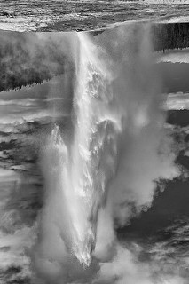

# A4-Learning-Image Orientation

### Data Structure
We have read the training and test data into a list of dictionaries, like below format-
```
[
	{"id" : "test/124567.jpg",
	 "gt_orient" : 180,
	  "pixels" : [13, 14, 154, 1, 19, . . . ]
	   "weight" : 0.014
	},
	 .
	 .
]
```

### K nearest neighbors
It is a classification technique in which we classify a test  point based on it's distance from it's neighbors.

#### Algorithm
```
1. Load the data
2. Initialise the value of k
3. For getting the predicted class, iterate from 1 to total number of test data points.
	4. Calculate the distance between test data and each row of training data. 
	Here we will use Euclidean distance as our distance metric.
	5. Sort the calculated distances in ascending order based on distance values
	6. Get top k rows from the sorted array
	7. Get the most frequent class of these rows
	8. Return the predicted class
```
>The training time is insignificant here because KNN algorithm uses training examples on test data directly. There is no training done here. Testing is very slow in this agorithm and it's also called lazy algorithm

#### Design decisions and tunable parameters
The factors that affect testing time are values of K and size of training data. Below are some charts showing variation of these.


> Figure 1. Accuracy vs Number of nearest neighbors

We can see here that the accuracy is better when K is greater than 65. On a broader sense, after a threshold value of K, the accuracy does not fluctuate significantly


>Figure 2. Testing time vs Number of nearest neighbors

We can see here that testing time does not fluctuate significantly with values of K chosen in the graph.


| No. of rows of dataset | Training time           | Accuracy             |
| ---------------------- | ----------------------- | ---------------------|
| 10000                  | 5.98 minutes            | 68.81 %              |
| 15000                  | 8.77 minutes            | 70.37 %              |
| 25000                  | 11.91 minutes           | 71.49 %              |
| 36976                  | 12.77 minutes           | 70.62 %              |

So, we decided to keep the value of K as 71 and size of training data as 16000. We have reduced the training data size because it was taking a long time to run on silo.(~12 mins)
### Adaboost
Adaboost is an ensemble learning technique in which classification is done by majority voting of a number of weak classifiers. The majority voting is done by taking weighted sum of class values spat out by each classifier. The weight considered here is called trust factor _alpha_ of a specific classifier.

Since image orientation is not a Binary classification problem (we have 4 classes 0, 90, 180, 270) So, we have performed a *1 vs All* technique where we have run adaboost binary classifiers on test images for each of the 4 orientation, and then predicted an orientation which has maximum value  out of 4 orientations.

#### Algorithm
```
1. for every train image vector do as below
	2. for each orientation do as below
		3. create classifiers
		4. calculate error of this classifier as sum of weights of misclassified train set
		5. decrease the weights of rightly classified data
		6. normalize the weights of train set
		7. calculate the trust factor 'alpha' proportional to error	
		8. push this classifier in classifier's list
```
>To create a weak classifier, we have tried random selection of 2 pixels. If difference between those 2 pixels is greater than 15, then it spits out 1 else -1.
Then we select two-third of weighted training set and run this classifier on it. If the accuracy of this classifier is more than 69%, then it is added to list of classifiers else another radom classifier is selected. This process is repeated untill we get 50 classifiers of each orientation. If we dont get enough classifiers until 2000 attempts are exhausted,  we spit out 200 random classifiers of any accuracy.

#### Design decisions and tunable parameters
We tuned the number of weak classifiers and saw how accuracy varies with it. The variation of accuracy and training time with number of weak classifiers are depicted in charts below.


> Figure 1. Accuracy vs Number of stumps.

We can see here that if we take more than 12 stumps, the accuracy doesnt fluctuate much.


>Figure 2. Training time vs Number of stumps

We can see here that the training time increases significantly if we increase the number of stumps.

So, We decided to take number of stumps as 50 so as to balance between training time and accuracy.

Also, a point to note here is we are using 69% as threshold accuracy for each classifier, and we do 2000 attempts for this. If we exhaust our attempts to find such classifiers for each orientation, then we just select 200 x 4 classifiers of any accuracy (aggregated accuracy drops by 4%). Then it takes a lot more time to train.

Below are measure of some parameters against size of training dataset (with 50 stumps of each orientation).

| No. of rows of dataset | Training time          | Accuracy             |
| ---------------------- | ---------------------- | ----------------------
| 10000                  | 1.02 minutes           | 25.40 %              |
| 15000                  | 1.71 minutes           | 30.06 %              |
| 25000                  | 2.5 minutes            | 60.14 %              |
| 36976                  | 3.3 minutes            | 69.46 %              |

### Random Forest
Random forest is a collection of decision trees. We have taken different number of decision trees and tried out different parameters for creating the decision trees. 

#### Design Decisions and Tunable Parameters
High level design decisions of the algorithm: We are trying to find a decision tree which correctly classifies the images according to their orientations. We are calling the build_tree function recursively to generate the subtrees under the tree, depending on the value of one particular dimension in the function. This dimension/predicate is chosen by finding out the minimum entropy among the remaining predicates. After we find the predicate, we split the dataset into 2 subsets.  Even though we have a continuous variable like pixel value, we are making it binary with respect to a threshold. So, if a pixel is lesser than the threshold, we send the data point to the left subtree of the decision tree, if it is greater, it goes to the right subtree.

We tested by tuning certain parameters:
1.	Purity: This is the purity of the dataset. We define the purity as the percentage/fraction of data of the current dataset that is required for this dataset to be a leaf node in the tree. We noticed that a lot of times we are stuck with no predicates in the function, and we are forced to make the highest orientation count as the leaf node, so we came up with the concept of purity. Purity is a value between 0 to 1. For example, for purity value=0.9 if in the current dataset, the fraction of labels of a certain orientation, say 90 degrees is more than 0.9, then the function will make it a leaf node of the decision tree and return the same.
2.	Number of trees: This is the number of trees in the forest. We tested on different values for this 
3.	Number of features/predicates in each tree: The number of predicates in each decision tree. We tested on different values for this.
4.	Threshold: We are taking the threshold value as 128 and forming a binary tree. 

#### Data Structure of Trees:
We are using a dictionary to keep the trees, inside each dictionary there is a list of 2 subtrees, generated recursively.
```
Predicate[i]: {
	[Predicate[j]: {….}, Predicate[k]: {…}]
}
```
Each dictionary will contain another subtree. When it reaches to the leaf nodes, it will store as:
```
{Label: [None, None]}
```
#### Algorithm Build Trees
```
Build-Tree(Subset S, Attributes P)
1. Count number of each label in S
2. If any label occurs more than purity threshold (e.g. 90%), return Label
3. If P has only 1 attribute, split S based on P’s threshold value, and return { Build-Tree (S-left, []), Build-Tree (S-right, [])} // This returns a dictionary with labels as the leaf nodes
4. IF P is empty, Return the maximum count label.
5. Else, if none of the above conditions are true,
6. 	C=Find the minimum entropy predicate from P.
7. 	Split S based on C’s threshold value.
8. Return { Build-Tree (S-left, P-{C}), Build-Tree (S-right, P-{C})} // This returns a dictionary with the predicate C as key, and a list of 2 subtrees as value.
```
#### Testing Results
We tested the accuracies with different values of the parameters, below are some of the results.


> Figure 1. Fixing Number of Trees=100, Features=14, Threshold=128. Plotted Accuracy v/s Purity.


- For Purity 60%: Accuracy=66.5%
- For Purity 80%: Accuracy=66.9%
- For Purity 90%: Accuracy=67.2%
- For Purity 100%: Accuracy=61%


>Figure 2. Fixing Number of Trees=100, Threshold=128, Purity=90%, Plotted Accuracy v/s Features

- Features: 20, Accuracy=62.88%
- Features: 25, Accuracy=63.94%
- Features: 14, Accuracy=67.2%
- Features: 12, Accuracy=65.9%


>Figure 3: Fixing Number of Trees=100, Purity=90% ,Features=14, Plotted Accuracy v/s Threshold

- Threshold: 120, Accuracy=66.4%
- Threshold: 128, Accuracy=67.2%
- Threshold: 140, Accuracy=65.4%

Considering All these, the best accuracy is given by:
>Threshold= 128

>Purity = 0.9

>Features = 14

We observed that accuracy slightly increases with the number of trees, we are fixing that as 100 here, after that it takes a long time to train, and accuracy does not increase significantly.

### General
##### Accuracies
> Adaboost: 69.78%


> Forest: 67.2%


> Nearest: 71.04%


Some correctly classified images:
> 


Some incorrectly classified images:
> 


The error pattern we observed that the class for 0 orientation has high accuracy, and other classes have low accuracy. It seems that pictures with high difference of pixel values have more probability of being classified correctly.

### How To's:

- train (create trained models)

`./orient.py train train_file.txt model_file.txt [model]`

- test (load model file and run tests)

`./orient.py test test_file.txt model_file.txt [model]`

- Model files
	- nearest_model.txt
	- forest_model.txt
	- adaboost_model.txt
	- best_model.txt
	
- Output files will be created
	- nearest_output.txt
	- forest_output.txt
	- adaboost_output.txt
	- best_output.txt
	
### Authors
- Shashank Shekhar (shashekh@iu.edu)
- Bivas Maiti (bmaiti@iu.edu)
- Ishneet Singh Arora (iarora@iu.edu)
